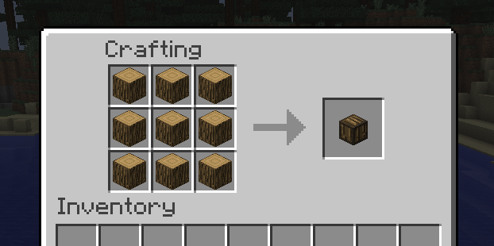

How to compress some blocks
===========================

Get a crafting table and do like on this picture. You can naturally do this crafts with all the blocks listed on the `Features page <features.html>`_:

So, you need to place 9 same blocks on a crafting table to get a compress block of this type.

See `How to uncompress a block <uncompress.html>`_.