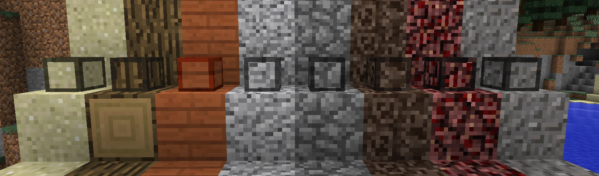

.. Compressed Blocks Plugin documentation master file, created by
   sphinx-quickstart on Wed Jun 14 19:58:28 2017.
   You can adapt this file completely to your liking, but it should at least
   contain the root `toctree` directive.

Welcome to Compressed Blocks Plugin !
=====================================

What is Compressed Blocks ?
---------------------------
This is a plugin that allow players to compress and uncompress blocks like Stone, Cobblestone, Woods, and many others. Don't waste space anymore, compress your blocks !

Get latest release
------------------
|  Latest release for **CraftBukkit** and **Spigot** version **1.11.x to 1.12**: `Direct link <https://github.com/Joffrey4/CompressedBlocksPlugin/releases/download/2.1/CompressedBlocksPlugin.jar>`_.
|  Detailed information's and other releases are available on the `Download Page <download.html>`_.

Features
--------
General `features <features.html>`_ of the plugin:

 - Compress lots of blocks (Cobblestone, Wood, Dirst, Sand, ...).
 - One compressed block stores 9 normal blocks.
 - Uncompress these blocks in your inventory, or a crafting table.
 - Save space in your chests.
 - Travel with more stuff in your pockets.
 - Be ready for big blocks' transactions
 - Give compressed blocks to players with a `command <commands.html>`_.
 - Use it as decorative for your constructions

.. centered:: Compressed Blocks is open source and hosted on GitHub. Feel free to fork, star, or contribute the project by making pull requests and opening issues. `Get on it Github <https://github.com/Joffrey4/CompressedBlocksPlugin>`_.

.. toctree::
   :maxdepth: 2
   :caption: Server Admin documentation

   features
   Download <download>
   commands
   permissions
   configuration
   Bug & issues <issues>

.. toctree::
   :maxdepth: 1
   :caption: Player documentation

   Compress <compress>
   Uncompress <uncompress>
   Placing <placing>
   FAQ <faq>
