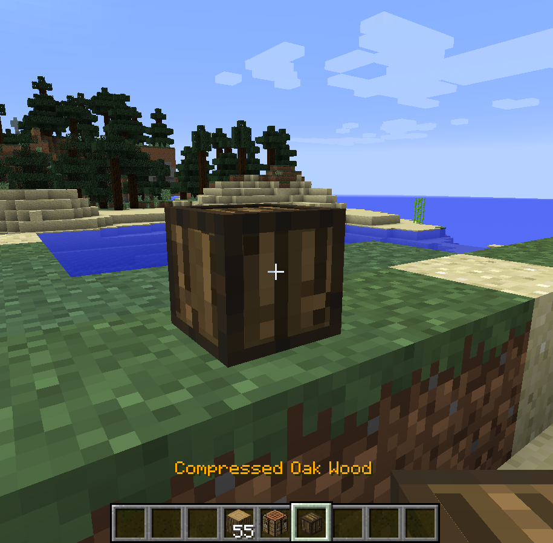
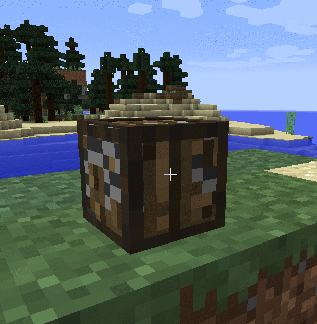

Block placing and destroying
============================

All compressed blocks can be placed in the world:

But, if you break one, you don't get back a compressed block: You got a random stack (between 5 and 9) of uncompressed blocks:

Currently, there's no way to get back a destroyed compressed block. But this functionality could be added in a future version.