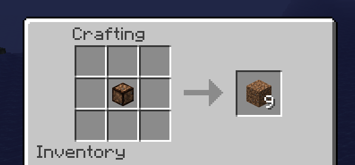
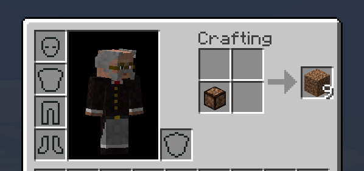

How to uncompress a block
=========================

The uncompression can be done on the crafting table:

Or in the inventory of the player:

Is a very simple craft: put a compressed block on a table and get back 9 normals blocks.

See `How to compress a block <compress.html>`_, and the `List of compressable blocks <features.html>`_.
